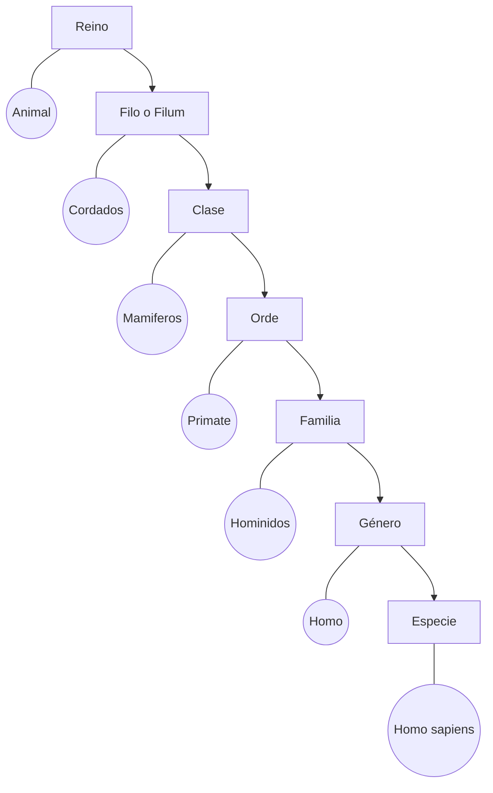

# Sistema de Dominio Taxonomico
Este proyecto fue presentando académico, consta con la idea de la taxonomía, su objetivo que lo hace muy útil es la cualidad de poder nombrar y clasificar en grupos que incluyan organismos semejantes entre sí, dicho de otra manera, es una rama biológica que se encarga de dar nombre y clasificar a los seres vivos.

# Clasificación

1. **Dominio:** Agrupación donde se ubican todos los seres vivos.
2. **Reino:** Divide a los seres vivos por su naturaleza en común. Los 5 reinos son reino animal, reino de las plantas, reino de los hongos, mónera o bacterias y protista.
3. **Filo o Filum:** Agrupa a los seres vivos por su mismo sistema de organización, por ejemplo, en el reino animal, los bivalvos, los gasterópodos y los cefalópodos tienen el mismo tipo de tejidos, reproducción, órganos y sistemas, por lo tanto se agrupan en el filo moluscos.
4. **Clase:** Un ejemplo de clase serían los mamíferos que incluye a todos los murciélagos, roedores, canguros, ballenas, grandes simios y al hombre.
5. **Orden:** El orden al que pertenece el ser humano, por ejemplo, es el orden de los primates, que comparte con los monos y los lémures.
6. **Familia:** Los gatos y los leopardos se incluyen en la familia de los felinos.
7. **Género:** El león y el tigre son especies muy similares que forman parte del género Panthera. Los perros no pueden reproducirse con los chacales porque no son de la misma especie, pero son lo suficientemente parecidos como para formar parte de un mismo género: canes.
8. **Especie:** Agrupa a los organismos que pueden entrecruzarse y que de ese cruce nazcan crías fértiles, es decir, que a su vez también puedan tener crías entre ellos.

## Idea del programa

Un nombre de *dominio taxonómico* es un texto compuesto por diferentes partes (categorías taxonómicas), las cuales se encuentran separadas por puntos “.”. Todas las categorías taxonómicas presentes en un nombre de dominio taxonómico pertenecen a una de las agrupaciones antes enumeradas y donde la categoría ubicada más a la izquierda corresponde al Reino al que pertenece el ser vivo, seguido por el Filo, luego la Clase y así sucesivamente hasta llegar a la Especie.
Un ejemplo de nombre de dominio taxonómico seria:

>“animal.cordado.mamífero.primate.homínido.homo.homo sapiens”

## Programa

Sistema de Nombres de Dominio Taxonómico (SNDT), el cual cuenta con los siguientes módulos:
1. Módulo de Administración: Este módulo permite realizar las siguientes operaciones:
	* a). Ingreso y almacenamiento de nombres de dominio taxonómico correspondientes a especies de seres vivos, junto con su tipo de:
		* Metabolismo:
			* I). Anabólico: transformación de las sustancias sencillas de los nutrientes en sustancias complejas.
			* II.) Catabólico: desdoblamiento de las sustancias complejas de los nutrientes mediante enzimas en moléculas más sencillas liberando energía.
		* Reproducción:
			* III). Asexual: El organismo es capaz de originar otros individuos nuevos, que son copias exactas del progenitor.
			* iv. Sexual: La reproducción sexual requiere la intervención de dos individuos de sexos diferentes y los descendientes serán resultado de la combinación de ambos progenitores.
	* b). Eliminación de nombres de especies, verificando que no quedaran categorías taxonómicas vacías (sin hijos) producto de la eliminación. En los casos donde dicha verificación no se cumpla seran eliminados de la estructura de datos.
2. Módulo de Consultas: El sistema es capaz de responder a las siguientes consultas:
	* a). Dado un nombre de dominio taxonómico correspondiente a una especie, imprime que tipo de metabolismo y reproducción posee.
	* b). Dado un nombre de dominio taxonómico correspondiente a una clase, imprime todas las especies que de ella dependan.
	* c). Dada una profundidad, imprime las categorías taxonómicas ubicadas a dicha profundidad.